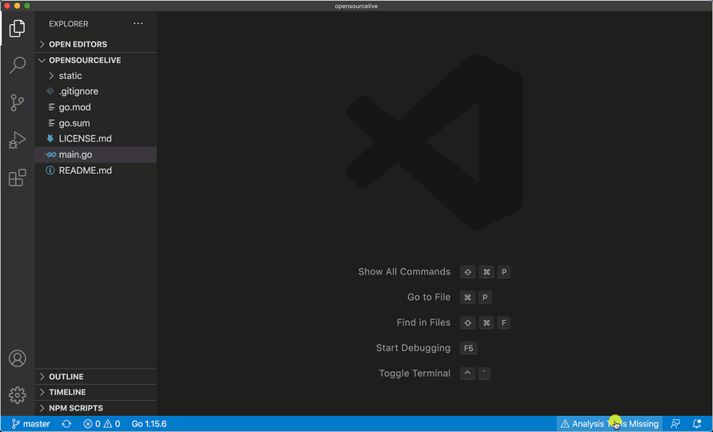

# Go for Visual Studio Code

[](https://gophers.slack.com/messages/vscode/)

<!--TODO: We should add a badge for the build status or link to the build dashboard.-->

[The VS Code Go extension](https://marketplace.visualstudio.com/items?itemName=golang.go) provides rich language support for the [Go programming language](https://golang.org/).

> 📣 We will enable the language server ([`gopls`]) by default in the end of Jan 2021.
> We recommend switching to the language server now (`"go.useLanguageServer": true`) to confirm it works well for you.
> Please [file a new issue](https://github.com/golang/vscode-go/issues/new/choose) if you notice bugs or missing features.

## Quick Start

Welcome! 👋🏻<br/>
Whether you are new to Go or an experienced Go developer, we hope this extension fits your needs and enhances your development experience.

- **Step 1.** If you haven't done so already, install [Go](https://golang.org) and the [VS Code Go extension](https://marketplace.visualstudio.com/items?itemName=golang.go).
	- [Go installation guide](https://golang.org/doc/install). This extension works best with Go 1.14+.
	- [Manage extensions in VS Code](https://code.visualstudio.com/docs/editor/extension-gallery)
- **Step 2.** To activate the extension, open any directory or workspace containing Go code. Once activated, the [Go status bar](docs/ui.md) will appear in the bottom left corner of the window and show the recognized Go version.
- **Step 3.** The extension depends on [a set of extra command-line tools](#tools). If they are missing, the extension will show the "⚠️ Analysis Tools Missing" warning. Click the notification to complete the installation.

<p align="center"></img>
<br/><em>(Install Missing Tools)</em>
</p>

You are ready to Go :-) &nbsp;&nbsp; 🎉🎉🎉

Please be sure to learn more about many [features](#features) of this extension as well as how to [customize](#customization) them. Take a look at [Troubleshooting](docs/troubleshooting.md) and [Help](#ask-for-help) for further guidance.

If you are new to Go, [this article](https://golang.org/doc/code.html) provides the overview on go code organization and basic `go` commands. The recent [Go open source live video](https://opensourcelive.withgoogle.com/events/go/watch?talk=session3) featured VS Code Go and demonstrated how other Gophers use the features to enhance their Go development workflow.

## Features

This extension provides many features, including [IntelliSense](docs/features.md#intellisense), [code navigation](docs/features.md#code-navigation), and [code editing](docs/features.md#code-editing) support. It also shows [diagnostics](docs/features.md#diagnostics) as you work and provides enhanced support for [testing](docs/features.md##run-and-test-in-the-editor) and [debugging](#debugging) your programs. See the [full feature breakdown](docs/features.md) for more details and to learn how to tune the behavior.

<p align=center></img>
<br/><em>(Code completion and Signature Help)</em>
</p>

In addition to integrated editing features, the extension provides several commands for working with Go files. You can access any of these by opening the Command Palette (`Ctrl+Shift+P` on Linux/Windows and `Cmd+Shift+P` on Mac), and then typing in the command name. See the [full list of commands](docs/commands.md#detailed-list) provided by the extension.

<p align=center></img>
<br/><em>(Toggle Test File)</em></p>

**⚠️ Note**: the default syntax highlighting for Go files is provided by the [TextMate rule](https://github.com/jeff-hykin/better-go-syntax) embedded in VS Code, not by this extension.

## Tools

The extension uses a few command-line tools developed by the Go community. In particular, `go`, `gopls`, and `dlv` are the main tools that implement build/test, language features, and debugging functionalities of this extension. See [Tools](docs/tools.md) for the full list of tools the extension depends on.

In order to locate the command-line tools, the extension searches `$GOPATH/bin` and directories specified in the `PATH` environment variable (or `Path` in Windows) with which the VS Code process has started. If the tools are not found, the extension will prompt you to install the missing tools and show the "⚠️ Analysis Tools Missing" warning in the bottom right corner. Please install them by responding to the warning notification, or by manually running the `Go: Install/Update Go Tools` command. The extension will run the [`go get`](https://golang.org/cmd/go) command to  install them.

## Setting up your workspace

[Modules](https://golang.org/ref/mod) are how Go manages the versions and dependencies in the recent versions of Go. Modules replace the old `GOPATH`-based approach to specifying which source files are used in a given build, and they are the default build mode after go1.16. While this extension continues to support both Go modules and `GOPATH`-mode, we highly recommend Go development in module mode. If you are working on existing projects, please consider migrating to modules.

Unlike the traditional `GOPATH`-mode, module mode does not require the workspace to be under `GOPATH` nor to use a specific structure. A module is defined by a tree of Go source files with a `go.mod` file in the tree's root directory. Your project may involve one or more modules. If you are working with multiple modules or uncommon project layouts, you will need to specifically configure your workspace, so features like references can work across modules. Please see the [Workspace document](https://github.com/golang/tools/blob/master/gopls/doc/workspace.md) for information on supported workspace layouts.

## Customization

The extension needs no configuration and should work out of the box. However, you may wish to modify settings to meet your needs. Please see the [Settings documentation](docs/settings.md) for the comprehensive list of extension configuration options.

### Choosing a different version of Go

The extension chooses the `go` command from the `$PATH` (or `$Path`) environment variable by default. You can configure this extension to choose a different version of Go with one of the following options.

  - (Preferred) Adjust your `$PATH` or `$Path` environment variable, and *open VS Code with the adjusted environment* variable, or
  - Use the Go extension's `"Go: Choose Go Environment"` command that opens a [menu](docs/ui.md) to change the `go` version, or
  - Use the `"go.alternateTools"` settings and specify the absolute path to the `go` command.
  ```
     "go.alternateTools": { "go": "/path/to/go/command" }
  ```

**note**: For historical reasons, some users use the `"go.goroot"` settings or the `GOROOT` environment variable to select the Go SDK location. With the recent versions of Go, that's unnecessary in most cases.

### Configuring the installation of command-line tools

`Go: Install/Update Tools` command uses the `go get` command to download and install requested tools. By default,  `go get` will install the compiled tools in one of the following directories.
  - the directory the `$GOBIN` environment variable specifies, or
  - the `bin` directory under the first `$GOPATH` (or `"go.gopath"`) directory, or
  - the `$HOME/go/bin` (or `$USERPROFILE/go/bin`) directory.
 
Some users prefer to choose a different installation location. In that case, use the `"go.toolsGopath"` setting. 

The extension finds the required tools by their names (`go`, `gopls`, `dlv`, ...). Sometimes, users may need to wrap the tools or want the extension to pick an alternate tool. `"go.alternateTools"` provides a way to configure the extension to use different tools.

### Using a custom linter

A commonly customized feature is the linter, which is a tool used to provide coding style feedback and suggestions.
This extension supports linters such as `staticcheck`, `golangci-lint`, and `revive`. You can choose one of them using the `"go.lintTool"` setting. For customization of the linter, please consult the tools' documentation.

If you are using `staticcheck`, you can enable it via the `gopls` settings block by setting
```
  "gopls": {
    "ui.diagnostic.staticcheck": true
  }
```

<!-- TODO: maybe have tips.md or settings.md to discuss more customization and setting tips (e.g. activating signature help after completion, disabling snippets to reduce the interference with gopls' suggestions, setting proxies, etc.) -->

### Working on the Go standard library and the Go tools

When you need to work on the Go project (https://go.googlesource.com/go), please follow the instruction in the [Standard Library Development](docs/stdlib.md) to adjust your settings.

## Ask for help

If you're having issues with this extension, please reach out to us by [filing an issue](https://github.com/golang/vscode-go/issues/new/choose) or asking a question on the [Gophers Slack]. We hang out in the `#vscode` channel!

Take a look at [learn.go.dev](https://learn.go.dev) and [golang.org/help](https://golang.org/help) for additional guidance.

## [Preview version](docs/nightly.md)

If you'd like to get early access to new features and bug fixes, you can use the nightly build of this extension. Learn how to install it in by reading the [Go Nightly documentation](docs/nightly.md).

## [Contributing](docs/contributing.md)

We welcome your contributions and thank you for working to improve the Go development experience in VS Code. If you would like to help work on the VS Code Go extension, please see our [contribution guide](docs/contributing.md). It explains how to build and run the extension locally, and it describes the process of sending a contribution.

## [Code of Conduct](CODE_OF_CONDUCT.md)

This project follows the [Go Community Code of Conduct](https://golang.org/conduct). If you encounter an issue, please mail conduct@golang.org.

## [License](LICENSE)

[MIT](LICENSE)

[Gophers Slack]: https://gophers.slack.com/
[`gopls`]: https://golang.org/s/gopls
[`go`]: https://golang.org/cmd/go
