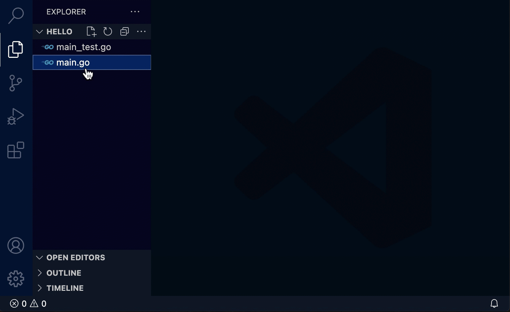
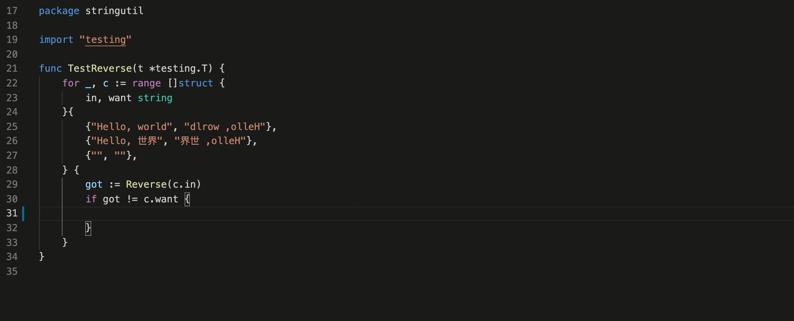
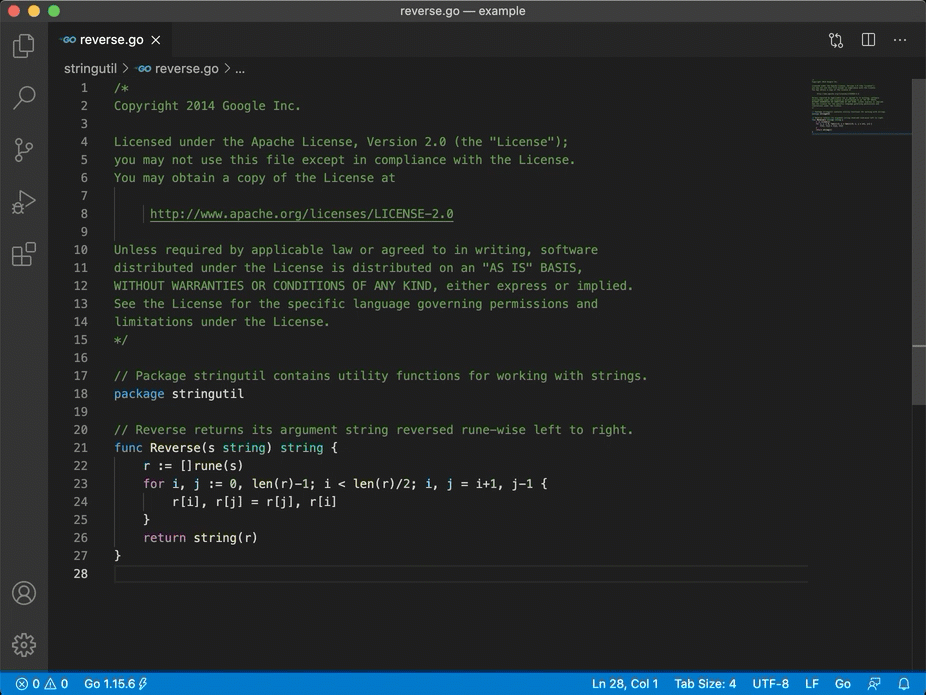

# Go for Visual Studio Code

[](https://gophers.slack.com/messages/vscode/)

<!--TODO: We should add a badge for the build status or link to the build dashboard.-->

[The VS Code Go extension](https://marketplace.visualstudio.com/items?itemName=golang.go)
provides rich language support for the
[Go programming language](https://go.dev/).

## Requirements

* Visual Studio Code 1.75 or newer (or editors compatible with VS Code 1.75+ APIs)
* Go 1.18 or newer

## Quick Start

Welcome! 👋🏻<br/>
Whether you are new to Go or an experienced Go developer, we hope this
extension fits your needs and enhances your development experience.

1.  Install [Go](https://go.dev) 1.18 or newer if you haven't already.

1.  Install the [VS Code Go extension].

1.  Open any Go file or go.mod file to automatically activate the extension. The
    [Go status bar](https://github.com/golang/vscode-go/wiki/ui) appears in the
    bottom right corner of the window and displays your Go version.

1.  The extension depends on `go`, `gopls` (the Go language server), and optional
    tools depending on your settings. If `gopls` is missing, the extension will
    try to install it. The :zap: sign next to the Go version indicates
    the language server is running, and you are ready to go.

<p align="center">

<br/>
<em>(Install Missing Tools)</em>
</p>

You are ready to Go :-) &nbsp;&nbsp; 🎉🎉🎉

## What's next

* Explore more [features][full feature breakdown] of the VS Code Go extension.
* View the
  [settings documentation](https://github.com/golang/vscode-go/wiki/settings)
	and [advanced topics](https://github.com/golang/vscode-go/wiki/advanced) to
	customize the extension.
* View the [tools documentation](https://github.com/golang/vscode-go/wiki/tools)
  for a complete list of tools the VS Code Go extension depends on. You can
  install additional tools and update them by using "Go: Install/Update Tools".
* Solve issues with the
  [general troubleshooting](https://github.com/golang/vscode-go/wiki/troubleshooting)
	and [debugging troubleshooting](https://github.com/golang/vscode-go/wiki/debugging#troubleshooting)
	guides.
* [file an issue](https://github.com/golang/vscode-go/issues/new/choose) for
  problems with the extension.
* Start a [GitHub discussion](https://github.com/golang/vscode-go/discussions)
  or get help on [Stack Overflow].
* Explore Go language resources on [go.dev/learn](https://go.dev/learn) and
  [golang.org/help](https://golang.org/help).

If you are new to Go, [this article](https://golang.org/doc/code.html) provides
the overview on Go code organization and basic `go` commands. Watch ["Getting
started with VS Code Go"] for an explanation of how to build your first Go
application using VS Code Go.

## Feature highlights

* [IntelliSense] - Results appear for symbols as you type.
* [Code navigation] - Jump to or peek at a symbol's declaration.
* [Code editing] - Support for saved snippets, formatting and code organization,
  and automatic organization of imports.
* [Diagnostics] -  Build, vet, and lint errors shown as you type or on save.
* Enhanced support for [testing] and [debugging]

See the [full feature breakdown] for more details.

<p align=center>

<br/>
<em>(Code completion and Signature Help)</em>
</p>

In addition to integrated editing features, the extension provides several
commands for working with Go files. You can access any of these by opening the
Command Palette (`Ctrl+Shift+P` on Linux/Windows and `Cmd+Shift+P` on Mac), and
then typing in the command name. See the
[full list of commands](https://github.com/golang/vscode-go/wiki/commands#detailed-list) provided by this
extension.

<p align=center>

<br/><em>(Toggle Test File)</em></p>

**⚠️ Note**: the default syntax highlighting for Go files is provided by a
[TextMate rule](https://github.com/jeff-hykin/better-go-syntax) embedded in VS
Code, not by this extension.

For better syntax highlighting, we recommend enabling
[semantic highlighting](https://code.visualstudio.com/api/language-extensions/semantic-highlight-guide)
by turning on [Gopls' `ui.semanticTokens` setting](https://github.com/golang/vscode-go/wiki/settings#uisemantictokens).
    ```
    "gopls": { "ui.semanticTokens": true }
    ```

## Setting up your workspace

The VS Code Go extension supports both `GOPATH` and Go modules modes.

[Go modules](https://golang.org/ref/mod) are used to manage dependencies in
recent versions of Go. Modules replace the `GOPATH`-based approach to specifying
which source files are used in a given build, and they are the default build
mode in go1.16+. We highly recommend Go development in module mode. If you are
working on existing projects, please consider migrating to modules.

Unlike the traditional `GOPATH` mode, module mode does not require the workspace
to be located under `GOPATH` nor to use a specific structure. A module is
defined by a directory tree of Go source files with a `go.mod` file in the
tree's root directory.

Your project may involve one or more modules. If you are working with multiple
modules or uncommon project layouts, you will need to configure your workspace
by using [Workspace Folders]. See the
[Supported workspace layouts documentation] for more information.

## Preview version

If you'd like to get early access to new features and bug fixes, you can use the
nightly build of this extension. Learn how to install it in by reading the
[Go Nightly documentation](https://github.com/golang/vscode-go/wiki/nightly).

## Telemetry

VS Code Go extension relies on the [Go Telemetry](https://go.dev/doc/telemetry) to
learn insights about the performance and stability of the extension and the
language server (`gopls`).
**Go Telemetry data uploading is disabled by default** and can be enabled
with the following command:

```
go run golang.org/x/telemetry/cmd/gotelemetry@latest on
```

After telemetry is enabled, the language server will upload metrics and stack
traces to [telemetry.go.dev](https://telemetry.go.dev). You can inspect what
data is collected and can be uploaded by running:

```
go run golang.org/x/telemetry/cmd/gotelemetry@latest view
```

If we get enough adoption, this data can significantly advance the pace of
the Go extension development, and help us meet a higher standard
of reliability. For example:

- Even with [semi-automated crash
  reports](https://github.com/golang/vscode-go/issues?q=is%3Aissue+is%3Aopen+label%3AautomatedReport)
  in VS Code, we've seen several crashers go unreported for weeks or months.
- Even with [a suite of
  benchmarks](https://perf.golang.org/dashboard/?benchmark=all&repository=tools&branch=release-branch.go1.20),
  some performance regressions don't show up in our benchmark environment (such
  as the [completion bug](https://go.dev/issue/62665) mentioned below!).
- Even with [lots of great
  ideas](https://github.com/golang/go/issues?q=is%3Aissue+is%3Aopen+label%3Agopls+label%3Afeaturerequest)
  for how to improve gopls, we have limited resources. Telemetry can help us
  identify which new features are most important, and which existing features
  aren't being used or aren't working well.

These are just a few ways that telemetry can improve gopls. The [telemetry blog
post series](https://research.swtch.com/telemetry-uses) contains many more.

Go telemetry is designed to be transparent and privacy-preserving. Learn more at
[https://go.dev/doc/telemetry](https://go.dev/doc/telemetry).

## Contributing

We welcome your contributions and thank you for working to improve the Go
development experience in VS Code. If you would like to help work on the VS Code
Go extension, see our
[contribution guide](https://github.com/golang/vscode-go/wiki/contributing) to
learn how to build and run the VS Code Go extension locally and contribute to
the project.

## Code of Conduct

This project follows the
[Go Community Code of Conduct](https://golang.org/conduct). If you encounter a
conduct-related issue, please mail conduct@golang.org.

## License

[MIT](LICENSE)

[Stack Overflow]: https://stackoverflow.com/questions/tagged/go+visual-studio-code
[`gopls`]: https://golang.org/s/gopls
[`go`]: https://golang.org/cmd/go
[Managing extensions in VS Code]: https://code.visualstudio.com/docs/editor/extension-gallery
[VS Code Go extension]: https://marketplace.visualstudio.com/items?itemName=golang.go
[Go installation guide]: https://golang.org/doc/install
["Getting started with VS Code Go"]: https://youtu.be/1MXIGYrMk80
[IntelliSense]: https://github.com/golang/vscode-go/wiki/features#intellisense
[Code navigation]: https://github.com/golang/vscode-go/wiki/features#code-navigation
[Code editing]: https://github.com/golang/vscode-go/wiki/features#code-editing
[diagnostics]: https://github.com/golang/vscode-go/wiki/features#diagnostics
[testing]: https://github.com/golang/vscode-go/wiki/features#run-and-test-in-the-editor
[debugging]: https://github.com/golang/vscode-go/wiki/debugging#features
[full feature breakdown]: https://github.com/golang/vscode-go/wiki/features
[workspace documentation]: https://github.com/golang/tools/blob/master/gopls/doc/workspace.md
[`Go: Install/Update Tools` command]: https://github.com/golang/vscode-go/wiki/commands#go-installupdate-tools
[Supported workspace layouts documentation]: https://github.com/golang/tools/blob/master/gopls/doc/workspace.md
[Workspace Folders]: https://code.visualstudio.com/docs/editor/multi-root-workspaces
