# Debugging

The Go extension allows you to launch or attach to Go programs for debugging. You can inspect variables and stacks, setting breakpoints, and do other debugging activities using [VS Code’s Debugging UI](https://code.visualstudio.com/docs/editor/debugging).

These debugging features are possible by using [Delve](https://github.com/go-delve/delve), the Go debugger.
The Go extension has been communicating with Delve through a custom debug adapter program (`legacy` mode).
As the new [`Delve`'s native DAP implementation](https://github.com/go-delve/delve/tree/master/service/dap) becomes available,
the Go extension is transitioning to skip the legacy debug adapter and directly communicate with Delve for local debugging.

 📣 **We are happy to announce that now this new mode of Delve integration (_`dlv-dap`_ mode) is enabled for _local_ _debugging_ by default!**

Delve DAP implementation's support for remote debugging is still a work in progress and the Go extension still uses
the legacy debug adapter for the debug configuration with the `"remote"` mode.

Many features and settings described in this document may be available only with the new `dlv-dap` mode.
For troubleshooting and configuring the legacy debug adapter, see [the legacy debug adapter documentation](https://github.com/golang/vscode-go/tree/master/docs/debugging-legacy.md).

## Getting Started

Open a file to debug (either `package main` source file or the test file) in the editor, and select the `Run and Debug` button from [the Run view](https://code.visualstudio.com/docs/editor/debugging#_run-view). Alternatively, you can start debugging using `Start Debugging (F5)` command from [the Run menu](https://code.visualstudio.com/docs/editor/debugging#_run-menu) or from [the Command Palette](https://code.visualstudio.com/docs/getstarted/userinterface#_command-palette) (Linux/Windows: Ctrl+Shift+P, Mac: ⇧+⌘+P).

When no configuration is configured yet (no `.vscode/launch.json` file), the extension will choose a default configuration based on the file open in the editor.

If you already have launch configurations for the project (`.vscode/launch.json`), the Run view will display the configuration list to choose from.

<p align="center">
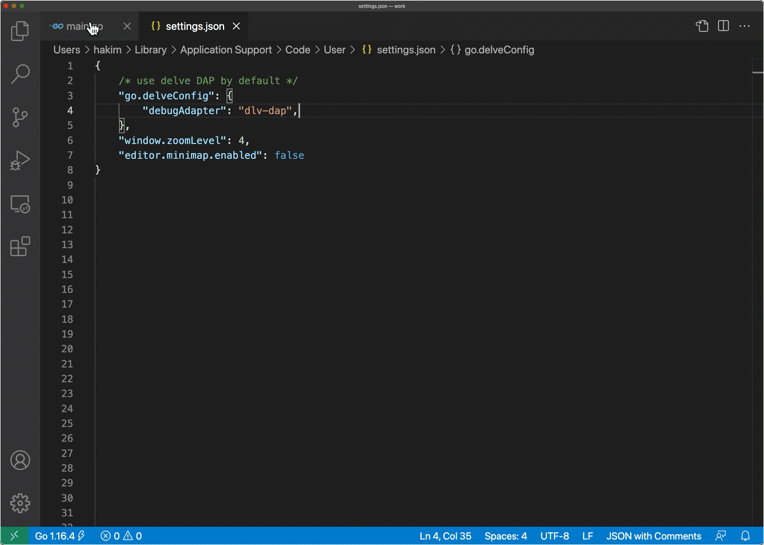
<br/>
<em>❗ When you start debugging in `dlv-dap` mode for the first time, the extension will ask to install  Delve built from head (`dlv-dap`). Please follow the instructions to install, and then start the debugging session again (i.e. selecting the source file, pressing F5 or click the codelens).</em>
</p>

<div style="text-align: center;"></div>

Watch ["Go: Writing and debugging fast, reliable, and efficient software"](https://www.youtube.com/watch?v=6r08zGi38Tk&list=PLj6YeMhvp2S40Q-TEPEKOeypLvTVd5uME&index=1) to learn more about debugging features.

Please review [the Features section](#features) that provides an overview of the debug UI and available features.
### Staying Up-To-Date

[Delve’s native DAP implementation](https://github.com/go-delve/delve/tree/master/service/dap) is under active development, so take advantage of the most recent features and bug fixes by using Delve built from its master branch. The Go extension maintains this newest version of Delve separately from the officially released version of `dlv` and installs it with the name `dlv-dap`.

The easiest way to update `dlv-dap` on demand is to use the `"Go: Install/Update Tools"` command from the Command Palette (Linux/Windows: Ctrl+Shift+P, Mac: ⇧+⌘+P). The command will show `dlv-dap` in the tool list. Select `dlv-dap`, and the extension will build the tool at master.

Once `dlv-dap` is installed on your system, the extension will prompt you for update whenever installing a newer version is necessary (usually after the Go extension upgrade). You can set the `go.toolsManagement.autoUpdate` setting so the extension can update `dlv-dap` automatically for you.

If you need to install `dlv-dap` manually outside of VS Code (for example, you are building a dev container with necessary tools preinstalled), please see the [Manual Installation](#bookmark=id.xuaxofprncd5) section.

### Switching to legacy debug adapter

If you need to use the legacy debug adapter (`legacy` mode) by default,
add the following in your VSCode settings.

Note that the extension still uses the legacy debug adapter for remote debugging.

```
    "go.delveConfig": {
        "debugAdapter": "legacy",
    }
```

If you want to switch to `legacy` for only a subset of your launch configurations, you can use [the `debugAdapter` attribute](#launchjson-attributes) to switch between `"dlv-dap"` and `"legacy"` mode.

If you chose to switch to legacy because of bugs or limitations in the new debug adapter,
please [open an issue](https://github.com/golang/vscode-go/issues/new)
to help us improve the new debug adapter.
## Features

For general debugging features such as inspecting variables, setting breakpoints, and other activities that aren't language-dependent, review [VS Code debugging](https://code.visualstudio.com/docs/editor/debugging).

### Configure

When you need more than the default debugging setup, you can create a launch configuration file for the project by clicking the "create a launch.json file" link in [the Run view](https://code.visualstudio.com/docs/editor/debugging#_run-view). Then, choose from the debug configuration drop-down menu. VS Code will create a `launch.json` file in a .vscode folder in your workspace (project root folder) or in your [user settings](https://code.visualstudio.com/docs/editor/debugging#_global-launch-configuration) or [workspace settings](https://code.visualstudio.com/docs/editor/multi-root-workspaces#_workspace-launch-configurations).

If you already have a `launch.json` for your project, you can open it using `Open launch.json`.

To add a new configuration to an existing `launch.json`, choose the "Add Configuration…" button to invoke the snippet IntelliSense.

<p align="center">
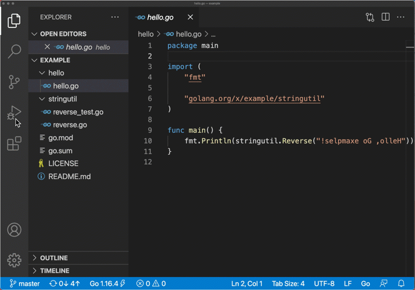
</p>

There are many configuration attributes (see [the Launch.json attributes](#launchjson-attributes) section). IntelliSense in VS Code’s launch.json editor will help you navigate available options and documentation.

### Launch

You can choose "Start Debugging (F5)" and "Run Without Debugging (^F5)" a.k.a the `noDebug` mode. This feature uses a `launch` request type configuration. Its `program` attribute needs to be either the go file or folder of the main package or test file. In this mode, the Go extension will start the debug session by building and launching the program. The launched program will be terminated when the debug session ends.

*   Supported modes
    *   `debug`: build and debug a main package
    *   `test`: build and debug a test
    *   `exec`: debug a precompiled binary. The binary needs to be built with `-gcflags=all="-N -l"` flags to avoid stripping debugging information.
    *   `auto`: automatically choose between `debug` and `test` depending on the open file.

### Attach

You can debug an already running program using the `attach` request type configuration. With the `attach` request, the Go extension starts `dlv-dap` and configures it to attach to the specified process. Users can select the process to debug with one of the following options:


*   Specifying the numeric process id (PID) with the `processId` attribute.
*   Specifying the target program name in the `processId` attribute. If there are multiple processes matching the specified program name, the extension will show the list of matching processes at the start of the debug session.
*   Specifying `0` in the `processId` attribute and selecting the process from the drop-down menu at the start of the debug session.

<p align="center">
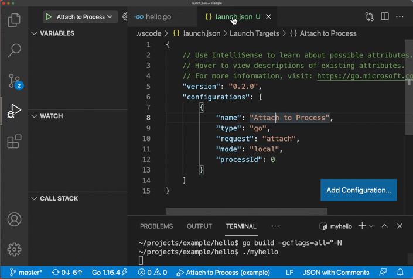
</p>

When you end the debug session, the debug UI allows you to choose to either

*   Disconnect: detach and leave the process running. (default)
*   Terminate: terminate the attached process.

<p align="center">
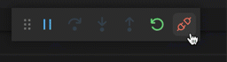
</p>

<!-- TODO:[SupportSuspendDebuggee](https://code.visualstudio.com/updates/v1_56#_disconnect-debugger-and-keep-debuggee-suspended) -->

###  Debug Actions

Once a debug session starts, the Debug toolbar will appear on the top of the editor.

<p align="center">
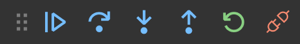
</p>

*   Continue / Pause F5
*   Step Over (aka `next` in Delve) F10
*   Step Into (aka `step` in Delve) F11
*   Step Out (aka `stepout` in Delve) Shift+F11 or ⇧F11
*   Restart (currently this is "Stop + Start")  Ctrl+Shift+F5 or ⇧⌘F5
*   Stop (terminate the debugee. Available in Launch request)  Shift+F5 or ⇧F5
*   Disconnect (detach from the debugee. Available only in Attach request) Shift+F5 or ⇧F5
*   Terminate (terminate the debugee. Available only in Attach request) Alt+Shift+F5 or ⌥⇧F5

### Breakpoints

See [VS Code’s Debug Documentation on Breakpoints](https://code.visualstudio.com/docs/editor/debugging#_breakpoints) to get familiar with VS Code’s UI. The Go debugger supports multiple ways to configure breakpoints.

*   **Breakpoints**: you can set breakpoints by clicking on the editor margin or using F9 on the current line. If the breakpoints can’t be set by Delve, VS Code will show the failure reason and grey out the dot.

<p align="center">
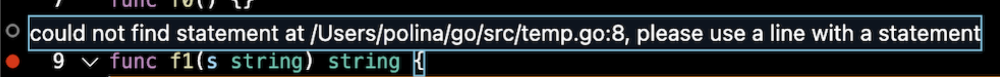
</p>

*   **Conditional breakpoints**: you can specify breakpoint conditions (similar to Delve’s [`condition` command](https://github.com/go-delve/delve/tree/master/Documentation/cli#condition)).
    *   Expression condition: takes a boolean expression.
    *   Hit count: supports comparison operators (`>`, `>=`, `<`, `<=`, `==`, `!=`) with an integer value. `% n` form means we should stop at the breakpoint when the hitcount is a multiple of `n`.

<p align="center">
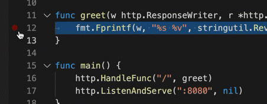
</p>

*   **Function Breakpoints**: breakpoints can be set based on function names.  Press the + button in the BREAKPOINTS section header and enter the location in the form of `<function>[:<line>]`. This sets the breakpoint in the `line` inside the `function`. The full syntax for `function` is `<package>.(*<receiver type>).<function_name>` as specified in [Delve’s location spec](https://github.com/go-delve/delve/blob/master/Documentation/cli/locspec.md#location-specifiers). Function breakpoints are shown with a red triangle in the BREAKPOINTS section.

<p align="center">
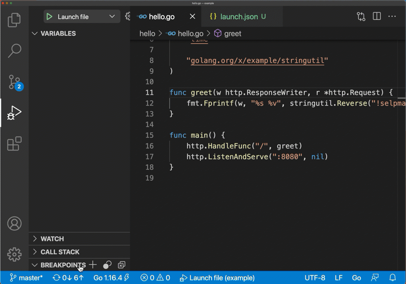
</p>

*   Logpoint (WIP)

### Data Inspection

You can inspect variables in the VARIABLES section of the Run view or by hovering over their source in the editor. Variable values and expression evaluation are relative to the selected stack frame in the CALL section.

By default, the VARIABLES section hides global variables, and shows only local variables and function arguments. However, you can still inspect global variables from the DEBUG CONSOLE panel. If you prefer to have the VARIABLES section show global variables, set the `showGlobalVariables` attribute in the `launch.json` configuration, or set it in the `go.delveConfig` setting.

When you select a variable and right click from the VARIABLES section, the context menu will present shortcuts to features such as:

*   `Set Value`: you can set/modify simple string, numeric, pointer values. Using composite literals, or memory allocation is not supported.
*   `Copy Value`: this copies the value in clipboard.
*   `Copy as Expression`: this is useful when you need to query from the REPL in the DEBUG CONSOLE panel.
*   `Add to Watch`: this will automatically add the expression to the WATCH section.

Shadowed variables will be marked with `()`.

<p align="center">
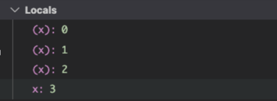
</p>

⚠️ Delve debugger imposes variable loading limits to prevent loading too many variables at once and negatively impacting debugging latency. The `dlv-dap` mode uses a different approach. It takes advantage of the interactive UI features to provide on-demand loading of individual variables, paging of arrays, slices and maps and increased string limits depending on the context. We continue to explore additional interactive features to balance performance and usability of variable loading and look forward to your feedback.

You can inspect variables and evaluate expressions from the DEBUG CONSOLE panel too. Acceptable expressions are either

*   A valid [Delve expression](https://github.com/go-delve/delve/blob/master/Documentation/cli/expr.md), or
*   `call <function_call_expression>` to call functions.

<p align="center">
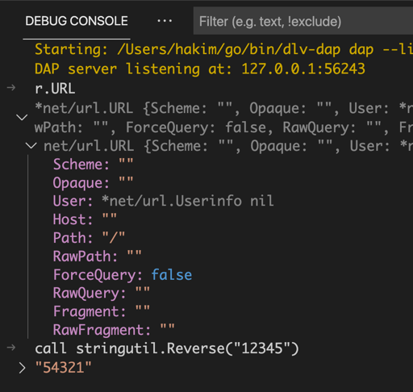
</p>

Variables and expressions accepted in DEBUG CONSOLE can be also registered in the Run view’s WATCH section, so they can be evaluated automatically as you debug. The "Add to Watch" feature from the VARIABLES section is convenient when you want to register interesting variables.

⚠️ Function call feature is highly EXPERIMENTAL due to the limitation in Go runtime. Registering function calls in the WATCH section can often be problematic. Pause, stop, and disconnect will not work while a function call is running.

Hover over variables in editors during debugging shows the value of the variable. For this feature, VS Code extracts the variable expression and makes a request to the debugger to evaluate the expression. Delve evaluates the expression relative to the highlighted stack frame chosen in the CALL STACK. By default, that is the current top-most frame.

<p align="center">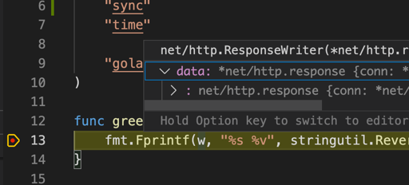
 </p>

⚠️ Limitation

*   VS Code heuristically determines the variable expression without full understanding of the scope & the currently selected frame. Delve tries to evaluate the provided expression in the selected frame. As a result, hover over variables outside the selected frame’s function may present incorrect information.

### Call Stack

You can inspect all goroutines and their stacks in the CALL STACK section. The CALL STACK section UI allows switching between goroutines or selecting a different stack frame. As a different stack frame or different goroutine is selected, the scope shown in the VARIABLE section will be updated for the newly selected stack frame, and the expressions in the WATCH section will be automatically reevaluated relative to the newly selected stack frame.

<p align="center">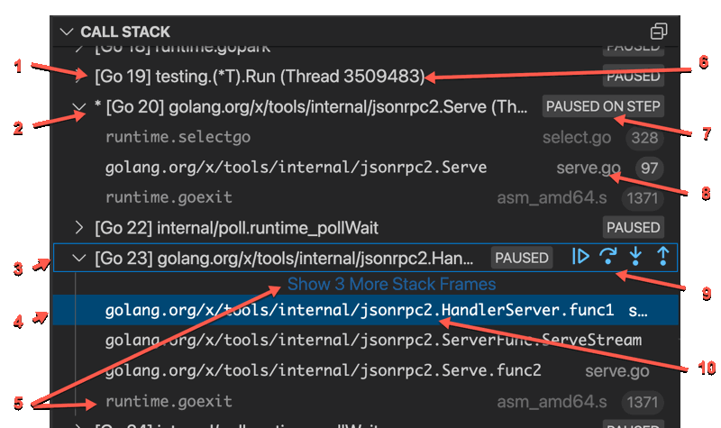 </p>

1. Goroutine stacks are annotated with their internal goroutine IDs.
2. The current goroutine is marked with `*`. If multiple goroutines stop (e.g. hit breakpoints) concurrently, Delve will pick one randomly. There also might not be a current goroutine (e.g. deadlock, pause or internal breakpoint hit by a system thread not running a goroutine).
3. If you click a goroutine call stack from the CALL STACK section, the goroutine is _selected_.
4. You can select a frame of the selected goroutine. The VARIABLE and WATCH sections will be updated accordingly and the cursor in the editor will be moved to the corresponding location in the source code.
5. Runtime stack frames are deemphasized (greyed out or collapsed).
6. Thread IDs are shown for scheduled goroutines.
7. Stop reason. It’s possible that there are multiple reasons goroutines were stopped, but currently only one reason is presented.
8. File name and line number of the frame.
9. You can trigger a debug action with the selected goroutine. Note: Resuming or stopping only a single goroutine (Go Issue [25578](https://github.com/golang/go/issues/25578), [31132](https://github.com/golang/go/issues/31132)) is currently not supported, so the action will cause all the goroutines to get activated or paused.
10. Function name of the frame.

When the program stops due to exception, panic, or bad access error, the CALL STACK shows the stop reason and the editor highlights the source location with more details.

<p align="center">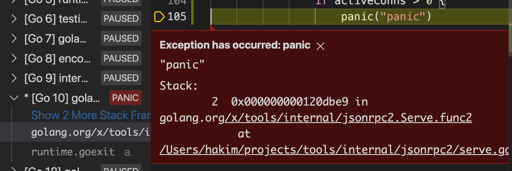</p>

## Configuration

### Launch.json Attributes

There are many attributes that you can adjust in the launch and attach debug configuration. The following general attributes are mandatory for all launch configurations.

*   `name`: the name of your configuration as it appears in the drop-down in the Run view.
*   `type`: the debugging type VS Code uses to decide which debugging extension should be used. Always leave this set to `"go"`.
*   `request`: `launch` or `attach`.

Here is the list of attributes specific to Go debugging.

<!-- DO NOT EDIT: Auto-generated by go run tools/generate -->
<!-- SETTINGS BEGIN -->
| Property | Launch | Attach |
| --- | --- | --- |
| `args` | Command line arguments passed to the debugged program.<br/> | <center>_n/a_</center> |
| `backend` | Backend used by delve. Maps to `dlv`'s `--backend` flag.<br/><p>Allowed Values: `"default"`, `"native"`, `"lldb"`, `"rr"`<br/> | <center>_same as Launch_</center>|
| `buildFlags` | Build flags, to be passed to the Go compiler. Maps to dlv's `--build-flags` flag.<br/>(Default: `""`)<br/> | <center>_n/a_</center> |
| `coreFilePath` | Path to the core dump file to open. For use on 'core' mode only<br/>(Default: `""`)<br/> | <center>_n/a_</center> |
| `cwd` | Workspace relative or absolute path to the working directory of the program being debugged if a non-empty value is specified. The `program` folder is used as the working directory if `cwd` is omitted or empty.<br/>(Default: `""`)<br/> | Workspace relative or absolute path to the working directory of the program being debugged. Default is the current workspace.<br/>(Default: `"${workspaceFolder}"`)<br/> |
| `debugAdapter` | Select which debug adapter to use with this launch configuration.<br/><p>Allowed Values: `"legacy"`, `"dlv-dap"`<br/>(Default: `dlv-dap`)<br/> | <center>_same as Launch_</center>|
| `dlvFlags` | Extra flags for `dlv`. See `dlv help` for the full list of supported. Flags such as `--log-output`, `--log`, `--log-dest`, `--api-version`, `--output`, `--backend` already have corresponding properties in the debug configuration, and flags such as `--listen` and `--headless` are used internally. If they are specified in `dlvFlags`, they may be ignored or cause an error.<br/> | <center>_same as Launch_</center>|
| `env` | Environment variables passed to the program.<br/> | <center>_n/a_</center> |
| `envFile` | Absolute path to a file containing environment variable definitions. Multiple files can be specified by provided an array of absolute paths<br/>(Default: `${workspaceFolder}/.env`)<br/> | <center>_n/a_</center> |
| `hideSystemGoroutines` | Boolean value to indicate whether system goroutines should be hidden from call stack view.<br/>(Default: `false`)<br/> | <center>_same as Launch_</center>|
| `host` | In legacy mode, this will only apply to remote-attach configurations, which will look for "dlv ... --headless --listen=<host>:<port>" server started externally. In dlv-dap mode (which does not yet support remote-attach), this will apply to all other configurations. The extension will try to connect to an external server started with "dlv dap --listen=<host>:<port>" to ask it to launch/attach to the target process.<br/>(Default: `"127.0.0.1"`)<br/> | <center>_same as Launch_</center>|
| `logDest` | dlv's `--log-dest` flag. See `dlv log` for details. Number argument is not allowed. Supported only in `dlv-dap` mode, and on Linux and Mac OS.<br/> | dlv's `--log-dest` flag. See `dlv log` for details. Number argument is not allowed. Supported only in `dlv-dap` mode and on Linux and Mac OS.<br/> |
| `logOutput` | Comma separated list of components that should produce debug output. Maps to dlv's `--log-output` flag. Check `dlv log` for details.<br/><p>Allowed Values: `"debugger"`, `"gdbwire"`, `"lldbout"`, `"debuglineerr"`, `"rpc"`, `"dap"`<br/>(Default: `"debugger"`)<br/> | <center>_same as Launch_</center>|
| `mode` | One of `auto`, `debug`, `test`, `exec`, `replay`, `core`. In `auto` mode, the extension will choose either `debug` or `test` depending on active editor window.<br/><p>Allowed Values: `"auto"`, `"debug"`, `"test"`, `"exec"`, `"replay"`, `"core"`<br/>(Default: `auto`)<br/> | Indicates local or remote debugging. Local maps to the `dlv attach` command, remote maps to `connect`. `remote` is not supported in `dlv-dap` mode currently. Use `host` and `port` instead.<br/><p>Allowed Values: `"local"`, `"remote"`<br/>(Default: `local`)<br/> |
| `output` | Output path for the binary of the debugee.<br/>(Default: `"debug"`)<br/> | <center>_n/a_</center> |
| `port` | In legacy mode, this will only apply to remote-attach configurations, which will look for "dlv ... --headless --listen=<host>:<port>" server started externally. In dlv-dap mode (which does not yet support remote-attach), this will apply to all other configurations. The extension will try to connect to an external server started with "dlv dap --listen=<host>:<port>" to ask it to launch/attach to the target process.<br/>(Default: `2345`)<br/> | <center>_same as Launch_</center>|
| `processId` | <center>_n/a_</center> | <br/><p><b>Option 1:</b> Use process picker to select a process to attach, or Process ID as integer.<br/><p>Allowed Values: `"${command:pickProcess}"`, `"${command:pickGoProcess}"`<br/><br/><p><b>Option 2:</b> Attach to a process by name. If more than one process matches the name, use the process picker to select a process.<br/><br/><p><b>Option 3:</b> The numeric ID of the process to be debugged. If 0, use the process picker to select a process.<br/><br/>(Default: `0`)<br/> |
| `program` | Path to the program folder (or any go file within that folder) when in `debug` or `test` mode, and to the pre-built binary file to debug in `exec` mode. If it is not an absolute path, the extension interpretes it as a workspace relative path.<br/>(Default: `"${workspaceFolder}"`)<br/> | <center>_n/a_</center> |
| `remotePath` | <center>_n/a_</center> | (Deprecated) *Use `substitutePath` instead.*<br/>The path to the source code on the remote machine, when the remote path is different from the local machine. If specified, becomes the first entry in substitutePath.<br/>(Default: `""`)<br/> |
| `showGlobalVariables` | Boolean value to indicate whether global package variables should be shown in the variables pane or not.<br/>(Default: `false`)<br/> | <center>_same as Launch_</center>|
| `showLog` | Show log output from the delve debugger. Maps to dlv's `--log` flag.<br/>(Default: `false`)<br/> | <center>_same as Launch_</center>|
| `showRegisters` | Boolean value to indicate whether register variables should be shown in the variables pane or not.<br/>(Default: `false`)<br/> | <center>_same as Launch_</center>|
| `stackTraceDepth` | Maximum depth of stack trace collected from Delve.<br/>(Default: `50`)<br/> | <center>_same as Launch_</center>|
| `stopOnEntry` | Automatically stop program after launch.<br/>(Default: `false`)<br/> | Automatically stop program after attach.<br/>(Default: `false`)<br/> |
| `substitutePath` | An array of mappings from a local path (editor) to the remote path (debugee). This setting is useful when working in a file system with symbolic links, running remote debugging, or debugging an executable compiled externally. The debug adapter will replace the local path with the remote path in all of the calls.<br/><p><br/><ul><li>`"from"`: The absolute local path to be replaced when passing paths to the debugger.<br/>(Default: `""`)<br/></li><li>`"to"`: The absolute remote path to be replaced when passing paths back to the client.<br/>(Default: `""`)<br/></li></ul><br/> | An array of mappings from a local path (editor) to the remote path (debugee). This setting is useful when working in a file system with symbolic links, running remote debugging, or debugging an executable compiled externally. The debug adapter will replace the local path with the remote path in all of the calls.  Overriden by `remotePath`.<br/><p><br/><ul><li>`"from"`: The absolute local path to be replaced when passing paths to the debugger.<br/>(Default: `""`)<br/></li><li>`"to"`: The absolute remote path to be replaced when passing paths back to the client.<br/>(Default: `""`)<br/></li></ul><br/> |
| `trace` | Various levels of logging shown in the debug console & 'Go Debug' output channel. When using the `legacy` debug adapter, the logs will also be written to a file if it is set to a value other than `error`.<br/><p>Allowed Values: `"verbose"`, `"trace"`, `"log"`, `"info"`, `"warn"`, `"error"`<br/>(Default: `"error"`)<br/> | <center>_same as Launch_</center>|
| `traceDirPath` | Directory in which the record trace is located or to be created for a new output trace. For use on 'replay' mode only<br/>(Default: `""`)<br/> | <center>_n/a_</center> |
<!-- SETTINGS END -->

⚠️ `dlv-dap` needs file or directory values in the launch configuration to be absolute paths. When configuring those values, use [the VS Code variables substitution](https://code.visualstudio.com/docs/editor/variables-reference) - VS Code will resolve the variables inside strings in `launch.json` before passing the configuration to the Go extension and `dlv-dap`. For example, `${workspaceFolder}` will be replaced with the absolute path to the workspace root folder. When appropriate, the Go extension will resolve relative paths or home directory (~) before sending the configuration to `dlv-dap`.

### **Debugging symlink directories**

Since the debugger and go compiler use the actual filenames, extra configuration is required to debug symlinked directories. Use the substitutePath property to tell the `debugAdapter` how to properly translate the paths. For example, if your project lives in `/path/to/actual/helloWorld`, but the project is open in vscode under the linked folder `/path/to/hello`, you can add the following to your config to set breakpoints in the files in `/path/to/hello`:

```
{
    "name": "Launch remote",
    "type": "go",
    "request": "launch",
    "mode": "debug",
    "program": "/path/to/actual/helloWorld",
    "substitutePath": [
		{
			"from": "/path/to/hello",
			"to": "/path/to/actual/helloWorld",
		},
	],
}
```

<!--### Options for "Add Configuration"

TODO: clean up the snippets in package.json

TODO: auto-generate from package.json. -->

### Settings

You can adjust the default value of the following configuration properties using `go.delveConfig` settings. These default values are useful when you choose to run a debug session without the launch configuration set in `launch.json`. For example, debug sessions started using the `Debug Test` code lenses use the adjusted values from these settings.

*   [`go.delveConfig`](settings.md#go.delveConfig)
    *   `debugAdapter`: Controls which debug adapter to use (default: `legacy`). Select ‘dlv-dap’.
    *   `showGlobalVariables`: Show global variables in the Debug view (default: `false`).
    *   `substitutePath`: Path mappings to apply to get from a path in the editor to a path in the compiled program (default: `[]`).

⚠️ Where is the `dlvLoadConfig` setting? Delve debugger imposes variable loading limits to avoid loading too many variables at once and negatively impacting debugging latency. The legacy adapter supported `dlvLoadConfig` to adjust these limits for the duration of the session. The user therefore had to come up with a one-size-fits-all limit if the default behavior was not satisfactory. `dlv-dap` mode uses a different approach as described in [the Data Inspection section](#data-inspection). If this setting is configured and `dlv-dap` mode is used, the extension will show a warning prompt now. If the current variable loading behavior and internal limits are not working for you, please [open an issue](https://github.com/golang/vscode-go/issues/new) and share your feedback.

<p align="center">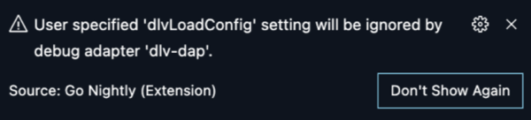 </p>

## Advanced Topics


### Go Debug Extension Architecture Overview

VS Code implements a generic, language-agnostic debugger UI based on [Debug Adapter Protocol](https://microsoft.github.io/debug-adapter-protocol/) (DAP), an abstract protocol for communicating with debugger backend. Previously, the Go extension used an intermediary typescript program (legacy debug adapter) to launch Delve and adapt Delve to DAP. With [the new, native DAP implementation in Delve](https://github.com/go-delve/delve/tree/master/service/dap), the intermediary program is no longer necessary, and efficient and tight integration with Delve becomes possible.

<p align="center">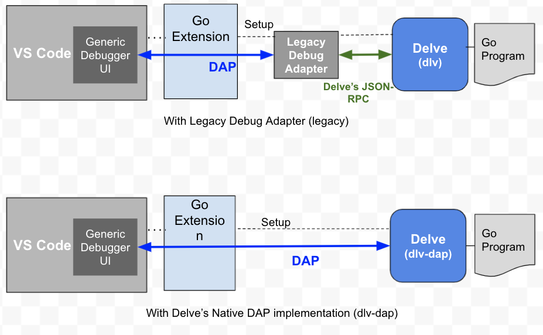 </p>

For information on debugging using the legacy debug adapter, please see the old [Debugging Documentation](https://github.com/golang/vscode-go/blob/master/docs/debugging.md). Note that many new or enhanced features discussed in this document may not be available with the legacy debug adapter.

### Manually installing `dlv-dap`

On rare occasions, you may want to install `dlv-dap` by yourself instead of letting the extension handle its installation.

First, find where the Go extension finds tools. Like [other tools the extension uses](https://github.com/golang/vscode-go/blob/master/docs/tools.md#tools), the Go extension searches the `dlv-dap` executable from `${GOPATH}/bin`, `${GOBIN}` and `${PATH}`  (or `Path` in Windows). So, install `dlv-dap` in the directory. The easiest way to check the tool installation location the Go extension uses is currently by running the `Go: Locate Configured Go Tools` command from the command palette (⇧+⌘+P or Ctrl+Shift+P).

The following commands download the source of Delve from the master branch, build & store as `dlv-dap` in `~/go/bin/` directory assuming the directory is the place you found from the first step.

If your Go version is 1.16 or newer:

```
$ GOBIN=/tmp/ go install github.com/go-delve/delve/cmd/dlv@master
$ mv /tmp/dlv $GOPATH/bin/dlv-dap
```

If your Go version is older than 1.16:

```
$ cd $(mktemp -d)
$ GO111MODULE=on GOBIN=/tmp/ go get github.com/go-delve/delve/cmd/dlv@master
$ mv /tmp/dlv $GOPATH/bin/dlv-dap
```

If you want to explicitly specify the location of the delve binary, use the `go.alternateTools` setting:
```json5
"go.alternateTools": {
    "dlv-dap": "<absolute path to your dlv binary>"
}
```

### Remote Debugging


> If you are able to use the [Remote Development](https://aka.ms/vscode-remote/download/extension) extensions and VS Code’s  universal [remote development capabilities](https://code.visualstudio.com/docs/remote/remote-overview), that is the recommended way to debug Go programs remotely. Check out [Getting started](https://code.visualstudio.com/docs/remote/remote-overview#_getting-started) section and [Remote tutorials](https://code.visualstudio.com/docs/remote/remote-overview#_remote-tutorials) to learn more.

Remote debugging is the debug mode intended to work with a debugger and target running on a different machine or a container. Support for remote debugging using Delve’s native DAP implementation is still a work-in-progress. This section describes a current temporary workaround and its limitations. If the following workaround is not working for your case, please file an issue and help us understand remote debugging use cases better.

<p align="center">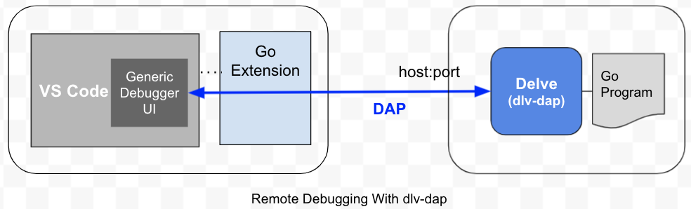 </p>

When using the dlv-dap mode, the delve instance running remotely needs to be able to process DAP requests, instead of the traditional JSON-RPC, used with an external `dlv --headless` server. The following command starts a Delve DAP server on port 12345 that is ready to accept a request from an editor such as VS Code for launching or attaching to a target.

```
$ dlv-dap dap --listen=:12345
```

Use the following `launch` configuration to tell `dlv-dap` to execute a binary precompiled with `-gcflags='all=-N -l'`:

```json5
{
  "name": "Connect to server (DAP)",
  "type": "go",
  "debugAdapter": "dlv-dap",
  "request": "launch",
  "port": 12345,
  "host": "127.0.0.1",
  "mode": "exec",
  "program": "/absolute/path/to/remote/workspace/program/executable",
  "substitutePath": [
      { "from": ${workspaceFolder}, "to": "/path/to/remote/workspace" },
      ...
  ]
}
```

Or have the binary compiled by dlv-dap by modifying the above configuration to use:

```json5
  "mode": "debug",
  "program": "/absolute/path/to/remote/workspace/package",
```

When seeing the `"port"` attribute being used in the launch request, Go extension will assume a Delve DAP server is started externally and accessible through the specified `host:port` and tell VS Code to connect to it directly. The `program` attribute must point to the absolute path to the package or binary to debug in the remote host’s file system even when `substitutePath` is specified.

⚠️ Limitations
*   Unlike `dlv <debug|exec|attach> --headless` commands traditionally used for remote debugging scenarios, Delve’s new `dap` sub command does not launch or attach to the debuggee process until it receives a Launch/Attach request. We understand this limitation, and we are currently working on addressing this limitation.
*   Anyone who can connect to the Delve DAP server’s host:port can exploit it to run arbitrary programs.
*   When using `"attach"` requests, you will need to specify the `processId` since
[the processId resolution feature](#attach) cannot gather process information running remotely.
*   Delve DAP does not support `--allow-multiclient` or `--continue` flags yet, which means after a debug session ends, the dlv-dap process will exit.
*   If you use `debug` or `test` mode `launch` requests, Delve builds the target binary. Delve tries to build the target from the directory where the `dlv` (or `dlv-dap`) process is running, so make sure to run the `dlv-dap` command from the directory you’d run the `go build` or `go test` command.

### Running Debugee Externally

Sometimes you’d like to launch the program for debugging outside VS Code (e.g., as a workaround of the missing `console` support), there are currently two options.

*   Compile and run the program from the external terminal and use [the "attach" configuration](#attach).
*   Use ["Remote Debugging"](#remote-debugging); run `dlv-dap dap --listen=:<port>` from the external terminal, and set the `"port"` attribute in your launch configuration.

## Reporting Issues

When you are having issues in `dlv-dap` mode, first check if the problems are reproducible after updating `dlv-dap`. It's possible that the problems are already fixed. Follow the instruction for [updating dlv-dap](#updating-dlv-dap)) and [updating extension](https://code.visualstudio.com/docs/editor/extension-gallery#\_extension-autoupdate).

Please report issues in [our issue tracker](https://github.com/golang/vscode-go/issues) with the following information.

*   `go version`
*   `go version -m <path/to/dlv-dap>`
*   VS Code and VS Code Go version (e.g. `code --version`)
*   Instructions to reproduce the issue (code snippets, your `launch.json`, screenshot)
*   DAP trace (See [the instruction](#collecting-logs))

### Collecting Logs

```json5
{
    "name": "Launch file",
    "type": "go",
    "trace": "verbose",
    "showLog": true,
    "logOutput": "dap",
    ...
}
```

The `logOutput` and `showLog` attributes in `launch.json` enable Delve-side logging (server-side) and DAP message tracing. The `trace` attribute controls the verbosity of Go extension's side logging (client-side).

The logging will appear in the `Go Debug` output channel (Command Palette -> "View: Toggle Output" -> Select "Go Debug" from the dropdown menu). By nature, debug logs may contain sensitive information. Please review the logs carefully before sharing debug logs.

## Developing

### Code location

The core part of Delve DAP implementation is in the [`service/dap`](https://github.com/go-delve/delve/tree/master/service/dap) package. Follow Delve project's [contribution guideline](https://github.com/go-delve/delve/blob/master/CONTRIBUTING.md#contributing-code) to send PRs.

Code for integration with the Go extension is mostly in [`src/goDebugFactory.ts`](https://github.com/golang/vscode-go/blob/master/src/goDebugFactory.ts) and tests are in [`test/integration/goDebug.test.ts`](https://github.com/golang/vscode-go/blob/master/test/integration/goDebug.test.ts). Please take a look at VS Code Go project's [contribution guideline](https://github.com/golang/vscode-go/blob/master/docs/contributing.md) to learn about how to prepare a change and send it for review.

### Testing

For simple launch cases, build the delve binary, and configure `"go.alternateTools"` setting.

```json5
"go.alternateTools": {
    "dlv-dap": <path_to_your_delve>
}
```

<p align="center">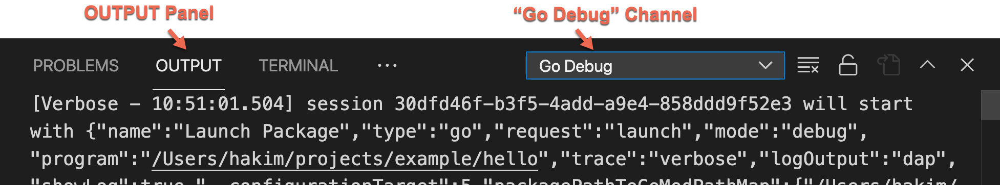</p>
If you are having issues with seeing logs and/or suspect problems in the extension's integration, you can start the Delve DAP server from a separate terminal and configure the extension to directly connect to it. Please remember to [file an issue](https://github.com/golang/vscode-go/issues/new) if you encounter any logging-related problems.

```
$ dlv-dap dap --listen=:12345 --log --log-output=dap
```

```json5
{
    "name": "Launch file",
    "type": "go",
    "request": "launch",
    "debugAdapter": "dlv-dap",
    ...
    "port": 12345
}
```

## FAQs

### Why does my debug session stop when I set breakpoints?

To support being able to set breakpoints while the program is running, the debug adapter needs to stop the program. Due to the extra synchronization required to correctly resume the program, the debug adapter currently sends a stopped event. This means that if you are editing breakpoints while the program is running, you will need to hit continue to continue your debug session. We plan to change the behavior of the debug adapter for more seamless editing of breakpoints. You can track the progress [here](https://github.com/golang/vscode-go/issues/1676).

### I need to view large strings. How can I do that if `dlvLoadConfig` with `maxStringLen` is deprecated?

The legacy adapter used `dlvLoadConfig` as one-time session-wide setting to override dlv's conservative default variable loading limits, intended to protect tool's performance. The new debug adapter is taking a different approach with on-demand loading of composite data and updated string limits, relaxed when interacting with individual strings. In particular, if the new default limit of 512, applied to all string values in the variables pane, is not sufficient, you can take advantage of a larger limit of 4096 with one of the following:

*   Hover over the variable in the source code
*   `Copy as Expression` to query the string via REPL in the DEBUG CONSOLE panel
*   `Copy Value` to clipboard

Please [open an issue](https://github.com/golang/vscode-go/issues/new) if this is not sufficient for your use case or if you have any additional feedback.

### Why does my debug session have an `invalid command` error when I try to step?

When stepping through a program on a particular goroutine, the debugger will make sure that the step is completed, even when interrupted by events on a different goroutine. If a breakpoint is hit on a different goroutine, the debug adapter will stop the program execution to allow you to inspect the state, even though the step request is still active.

If you attempt to make another step request you will get an `invalid command` error.

<p align="center">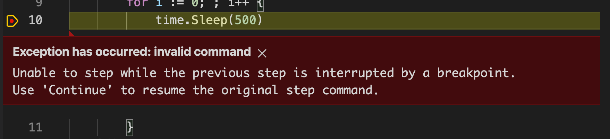 </p>


Use `Continue` to resume program execution.

If you do not want the step request to be interrupted, you can disable all breakpoints from VS Code from the context menu in the `Breakpoints` view.

<p align="center">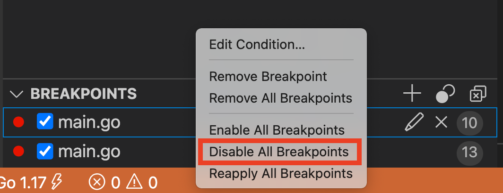 </p>


[Delve]: https://github.com/go-delve/delve
[VS Code variables]: https://code.visualstudio.com/docs/editor/variables-reference
[snippets]: https://code.visualstudio.com/docs/editor/userdefinedsnippets
[Command Palette]: https://code.visualstudio.com/docs/getstarted/userinterface#_command-palette
