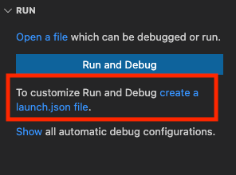
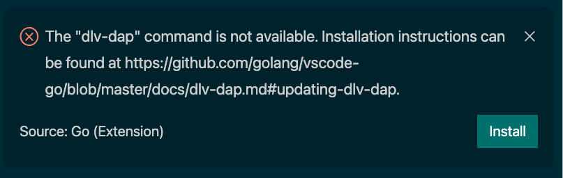

# Dlv DAP - Delve's native DAP implementation

[`Delve`'s native DAP implementation](https://github.com/go-delve/delve/tree/master/service/dap) is now available to be used to debug Go programs.

_________________
**🔥 This new adapter is still in active development, so to take advantage of the most recent features and bug fixes, you need to use Delve built from the dev branch. When the extension asks to install/update `dlv-dap`, please follow the instruction and rebuild the tool.**
_________________

The Go extension currently maintains this development version of Delve separately from the stable version of `dlv`. This version is installed with the name `dlv-dap`. Please follow the instruction in [Getting Started](#getting-started) to configure the extension and install `dlv-dap`.

This new debug adapter runs in a separate `go` process, which is spawned by VS Code when you debug Go code.
Please see the [Debug Adapter Protocol (DAP)](https://microsoft.github.io/debug-adapter-protocol/) to learn about how the Debug Adapter acts as an intermediary between VS Code and the debugger ([Delve](https://github.com/go-delve/delve)).


## Getting Started

You can choose which debug adapter to use with the `"debugAdapter"` field in [your `launch.json` configuration](https://github.com/golang/vscode-go/blob/master/docs/debugging.md#snippets). Most settings will continue to work with in this new `"dlv-dap"` mode except [a few caveats](#features-and-caveats).
If you do not already have a `launch.json`, select `create a launch.json file` from the debug pane and choose an initial Go debug configuration.

<div style="text-align: center;"> </div>

In your launch configuration, set the `"debugAdapter"` field to be `"dlv-dap"`. For example, a launch configuration for a file would look like:

```json5
{
    "name": "Launch file",
    "type": "go",
    "request": "launch",
    "mode": "auto",
    "program": "${fileDirname}",
    "debugAdapter": "dlv-dap"
}
```

To switch back to the legacy adapter, set `"debugAdapter"` to `"legacy"`.

When you start debugging using the configuration for the first time, the extension will ask you to install `dlv-dap`.

<div style="text-align: center;"> </div>

Once `dlv-dap` is installed, the extension will prompt you for update whenever installing a newer version is necessary (usually after the Go extension update).

### Updating dlv dap
The easiest way is to use the `"Go: Install/Update Tools"` command from the command palette (⇧+⌘+P or Ctrl+Shift+P). The command will show `dlv-dap` in the tool list. Select it, and the extension will build the tool at master.

If you want to install it manually, `go get` with the following command and rename it to `dlv-dap`.

```
$ GO111MODULE=on GOBIN=/tmp/ go get github.com/go-delve/delve/cmd/dlv@master
$ mv /tmp/dlv $GOPATH/bin/dlv-dap
```

## Features and Caveats
<!-- TODO: update the debugging section of features.md using dlv-dap mode -->

🎉  The new debug adapter offers many improvements and fixes bugs that existed in the old adapter. [Here](https://github.com/golang/vscode-go/issues?q=is%3Aissue+label%3Afixedindlvdaponly) is a partial list of enhancement/fixes available only in the new adapter.

* User-friendly inlined presentation of variables of all complex types (map, struct, pointer, array, slice, ...)
* Fixed handling of maps with compound keys
* Improved CALL STACK presentation
* Fixed automated "Add to Watch" / "Copy as Expression" expressions.
* Support to switch goroutines while stepping.
* Robust `call` evaluation.
* Good test coverage.


Most of all, the new adapter is written in Go and integrated in `dlv`. That will make it easier for the Go community to contribute. </br>
Because it is native, we hope for improvement in speed and reliability.

⚒️ The following features are still under development. 

* Stop/pause/restart while the debugged program is running does not work yet.
* Cannot be used with `debug test` codelens.
* Support for `"dlvFlags"` attributes in launch configuration is not available.
* `dlvLoadConfig` to configure max string/bytes length in [`"go.delveConfig"`](https://github.com/golang/vscode-go/blob/master/docs/debugging.md#configuration) does not work.
* [Remote debugging](https://github.com/golang/vscode-go/blob/master/docs/debugging.md#remote-debugging) is not supported.

Follow along with [golang/vscode-go#23](https://github.com/golang/vscode-go/issues/23) and the [project dashboard](https://github.com/golang/vscode-go/projects/3) for updates on the implementation.

## Reporting issues

The VS Code Go maintainers are reachable via the issue tracker and the #vscode-dev channel in the Gophers Slack. </br>
Please reach out on Slack with questions, suggestions, or ideas. If you have trouble getting started on an issue, we'd be happy to give pointers and advice.

When you are having issues in `dlv-dap` mode, first check if the problems are reproducible after updating `dlv-dap`. It's possible that the issues are already fixed. Follow the instruction for [updating dlv-dap](#updating-dlv-dap)) and [updating extension](https://code.visualstudio.com/docs/editor/extension-gallery#_extension-autoupdate).

Please report issues in [our issue tracker](https://github.com/golang/vscode-go/issues) with the following information.

* `go version`
* `go version -m dlv-dap`
* VS Code and VS Code Go version.
* Instruction to reproduce the issue (code snippets, your `launch.json`, screenshot)

## Developing

### Code location
The core part of Delve DAP implementation is in the [`service/dap`](https://github.com/go-delve/delve/tree/master/service/dap) package. Follow Delve project's [contribution guideline](https://github.com/go-delve/delve/blob/master/CONTRIBUTING.md#contributing-code) to send PRs.
Code for integration with the Go extension is mostly in [`src/goDebugFactory.ts`](https://github.com/golang/vscode-go/blob/master/src/goDebugFactory.ts) and tests are in [`test/integration/goDebug.test.ts`](https://github.com/golang/vscode-go/blob/master/test/integration/goDebug.test.ts). Please take a look at VS Code Go project's [contribution guideline](https://github.com/golang/vscode-go/blob/master/docs/contributing.md) to learn about how to prepare a change and send it for review.

### Testing
For simple launch cases, build the delve binary, and configure `"go.alternateTools"` setting.

```json5
"go.alternateTools": {
    "dlv-dap": <path_to_your_delve>
}
```

Set `logOutput` and `showLog` attributes in `launch.json` to enable logging and DAP message tracing.
```json5
{
    "name": "Launch file",
    "type": "go",
    "debugAdapter": "dlv-dap",
    "showLog": true,
    "logOutput": "dap",
    ...
}
```

If you are having issues with seeing logs and or suspect problems in extension's integration, you can start Delve DAP server from a separate terminal and configure the extension to directly connect to it.

```
$ dlv-dap dap --listen=:12345 --log-output=dap
```

```json5
{
    "name": "Launch file",
    "type": "go",
    "request": "launch",
    "debugAdapter": "dlv-dap",
    ...
    "port": 12345
}
```
