# Features

This document describes the features supported by this extension.

## Table of Contents

* [IntelliSense](#intellisense)
  * [Code completion](#code-completion)
  * [Signature help](#signature-help)
  * [Quick info on hover](#quick-info-on-hover)
* [Code Navigation](#code-navigation)
  * [Go to definition](#go-to-definition)
  * [Go to symbol](#go-to-symbol)
  * [Find references](#find-references)
  * [Find interface implementations](#find-interface-implementations)
  * [Document outline](#document-outline)
  * [Toggle between code and tests](#toggle-between-code-and-tests)
* [Syntax Highlighting](#syntax-highlighting)
* [Code Editing](#code-editing)
  * [Snippets](#snippets)
  * [Format and organize imports](#format-and-organize-imports)
    * [Add import](#add-import)
  * [Rename symbol](#rename-symbol)
  * [Refactor](#refactor)
* [Code Generation](#code-generation)
  * [Add or remove struct tags](#add-or-remove-struct-tags)
  * [Generate interface implementation](#generate-interface-implementation)
  * [Generate unit tests](#generate-unit-tests)
  * [Fill struct literals](#fill-struct-literals)
* [Diagnostics](#diagnostics)
  * [Build errors](#build-errors)
  * [Vet errors](#vet-errors)
  * [Lint errors](#lint-errors)
* [Run and test in the editor](#run-and-test-in-the-editor)
  * [Run your code](#run-your-code)
  * [Test and benchmark](#test-and-benchmark)
  * [Code coverage](#code-coverage)
  * [Profiling](#profiling)
* [Debug your code](#debugging)
* [Other](#other)
  * [Go Playground](#go-playground)

## [IntelliSense](https://code.visualstudio.com/docs/editor/intellisense)

### Code completion

Completion results appear for symbols as you type. You can trigger this manually with the Ctrl+Space shortcut.

Autocompletion is also supported for packages you have not yet imported into your program.

 

### Signature help

Information about the signature of a function pops up as you type in its parameters.
### Quick info on hover

Documentation appears when you hover over a symbol.

## [Code Navigation](https://code.visualstudio.com/docs/editor/editingevolved)

### Go to definition

Jump to or peek a symbol's declaration.

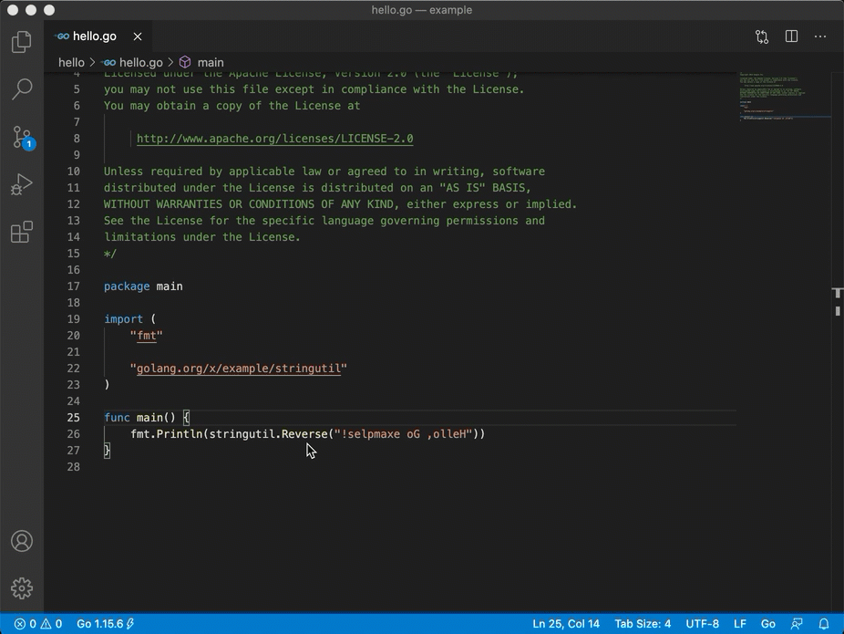 

### Find references

Find or go to the references of a symbol.

This feature is not available if you are using Go modules **without** [`gopls`](gopls.md), the Go language server.

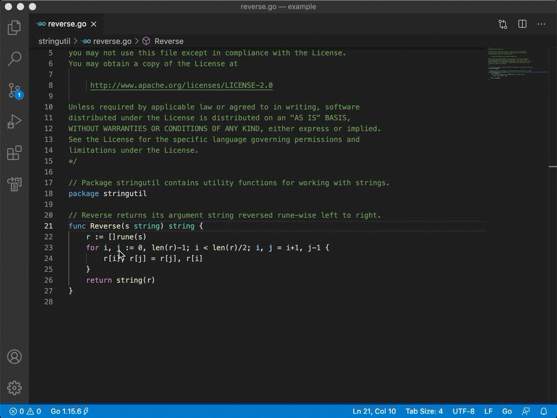 

### Find interface implementations

Find the concrete types that implement a given interface.

This feature is not available if you are using Go modules **without** [`gopls`](gopls.md), the Go language server.

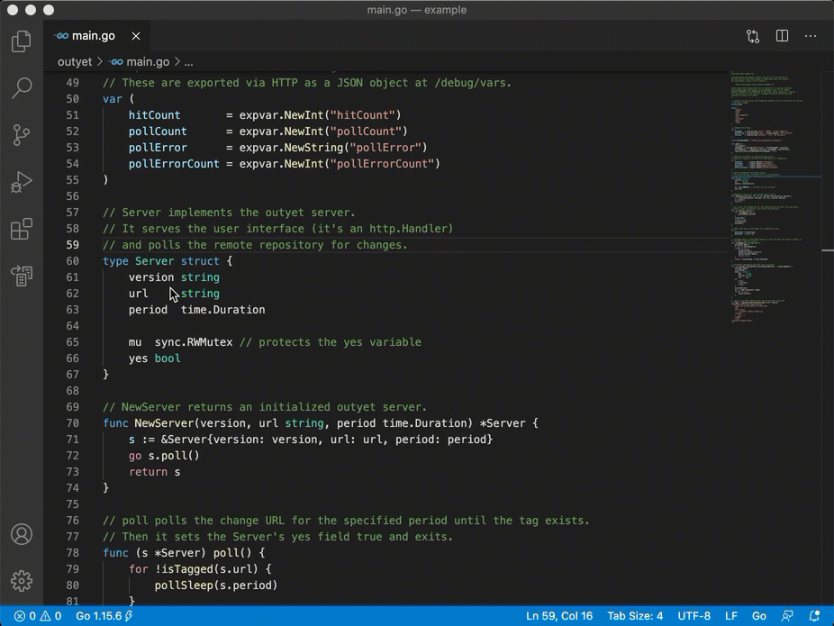 

### [Go to symbol](https://code.visualstudio.com/docs/editor/editingevolved#_go-to-symbol)

Search for symbols in your file or workspace by opening the Command Palette (Ctrl+Shift+P) and typing `@` for symbols in the current file or `#` for symbols in the entire workspace.

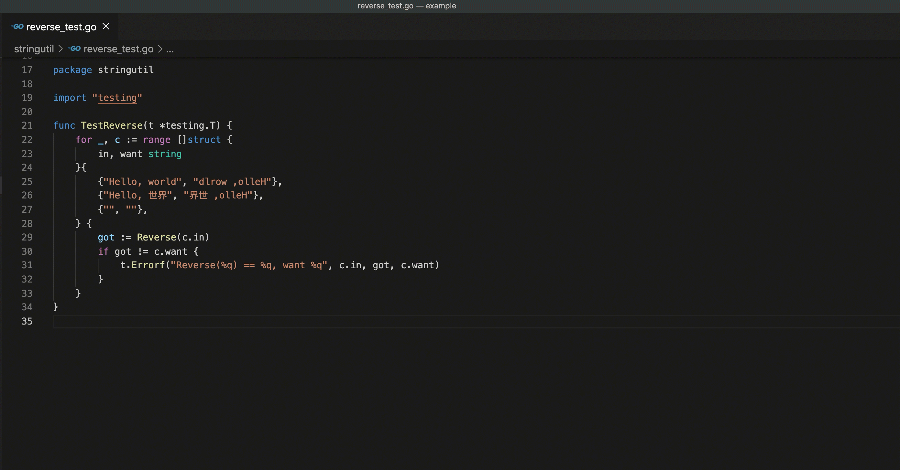 

### Call hierarchy

Show all calls from or to a function.

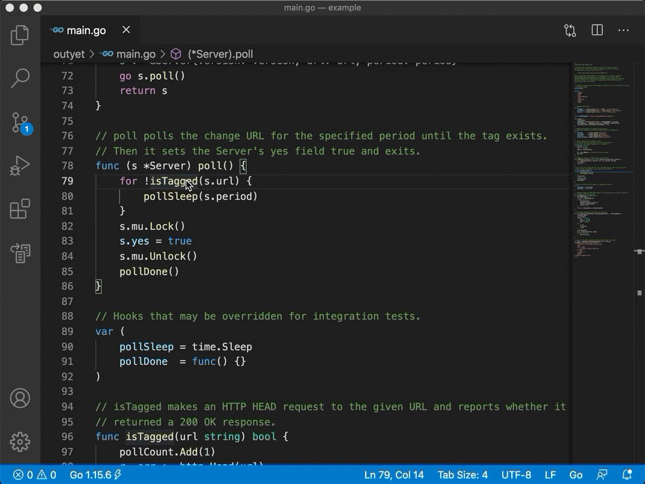 

### Document outline

See all the symbols in the current file in the VS Code's [Outline view](https://code.visualstudio.com/docs/getstarted/userinterface#_outline-view).

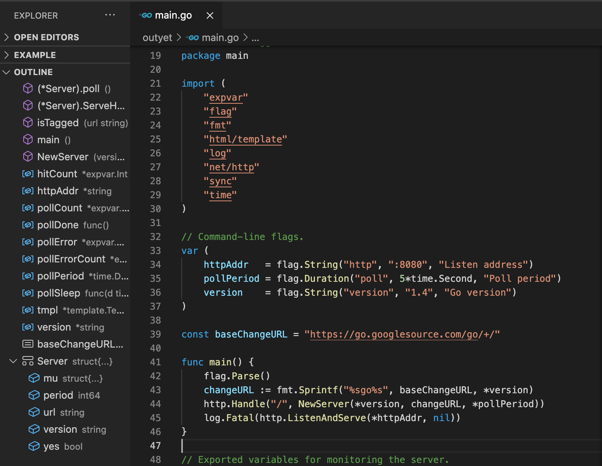 

### Toggle between code and tests

Quickly toggle between a file and its corresponding test file by using the [`Go: Toggle Test File`](commands.md#go-toggle-test-file) command.

 

## Syntax Highlighting

The default syntax highlighting for Go files is implemented in Visual Studio Code using TextMate grammar, not by this extension.

If you are using `gopls`, you can enable [Semantic Highlighting](https://code.visualstudio.com/api/language-extensions/semantic-highlight-guide) for more accurate syntax highlighting based on semantic tokenization using `"gopls": { "ui.semanticTokens": true }`.

### Go template syntax highlighting

When `gopls`'s semantic tokens feature is enabled, `gopls` also provides semantic tokens for Go template files (language identifier: `gotmpl`). By default, the extension associates all `*.tmpl` or `*.gotmpl` files in the workspace with `gotmpl` language. Users can override the language mode by using Visual Studio Code's UI or the `"files.associations"` setting. See [Visual Studio Code's doc](https://code.visualstudio.com/docs/languages/overview#_changing-the-language-for-the-selected-file) for more details.

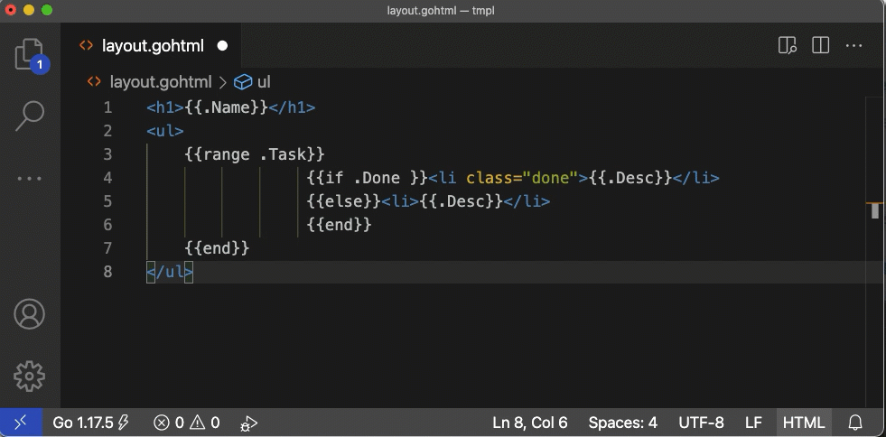 

## Code Editing

### [Snippets](https://code.visualstudio.com/docs/editor/userdefinedsnippets)

Predefined snippets for quick coding. These snippets will appear as completion suggestions when you type. Users can also define their own custom snippets (see [Snippets in Visual Studio Code](https://code.visualstudio.com/docs/editor/userdefinedsnippets#_create-your-own-snippets)).

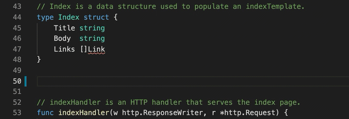 

### Format and organize imports

Format code and organize imports, either manually or on save.

The extension formats Go code, organizes imports, and removes unused imports by default. For different behavior, please override per-language default settings following [the instruction](advanced.md#formatting-code-and-organizing-imports).

When organizing imports, the imported packages are grouped in the default `goimports` style. In order to group some packages after 3rd-party packages, use [`"gopls": { "formatting.local": <comma-separated imports prefix>}`](settings.md#formattinglocal).

#### Add import

The extension organizes imports automatically and can add missing imports if the package is present in your module cache already. However, you can also manually add a new import to your file through the [`Go: Add Import`](commands.md#go-add-import) command. Available packages are offered from module cache (or from your `GOPATH` in GOPATH mode).

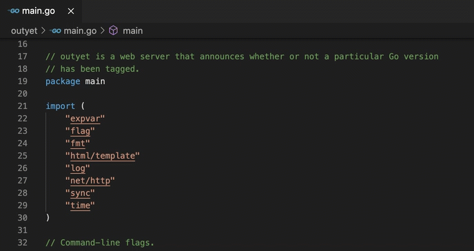 

### [Rename symbol](https://code.visualstudio.com/docs/editor/refactoring#_rename-symbol)

Rename all occurrences of a symbol in your workspace.

**Note**: For undo after rename to work on Windows, you need to have `diff` tool on your `PATH`.

This feature is not available if you are using Go modules **without** [`gopls`](gopls.md), the Go language server.

 

### Refactor

Select the area for refactoring (e.g. variable, function body, etc). Click on the Code Action light bulb icon
that appears in the selected area, or select "Refactoring..." or "Rename Symbol" from the VS Code Context menu.
For known issues with this feature see [golang/go#37170](https://github.com/golang/go/issues/37170).

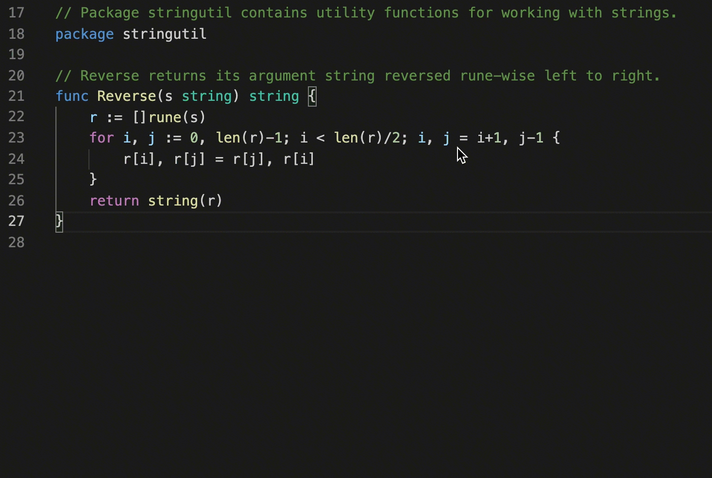 

## Code Generation

### Add or remove struct tags

Use the [`Go: Add Tags to Struct Fields`](commands.md#go-add-tags-to-struct-fields) command to automatically generate or remove [tags](https://pkg.go.dev/reflect?tab=doc#StructTag) for your struct. This feature is provided by the [`gomodifytags`](tools.md#gomodifytags) tool.

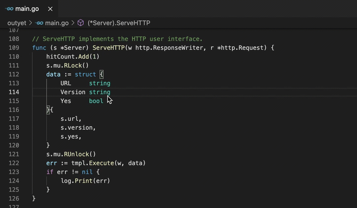 

### Generate interface implementation

Use the [`Go: Generate Interface Stubs`](commands.md#go-generate-interface-stubs) command to automatically generate method stubs for a given interface. This feature is provided by the [`impl`](tools.md#impl) tool.

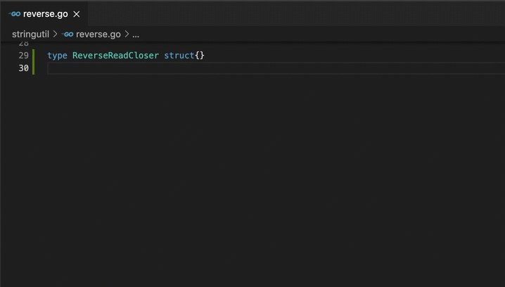 

### Generate unit tests

Easily generate unit tests for your project by running one of the [`Go: Generate Unit Tests for ...`](commands.md#go-generate-unit-tests-for-file) commands. This can be done at a function, file, or package level. This feature is provided by the [`gotests`](tools.md#gotests) tool.

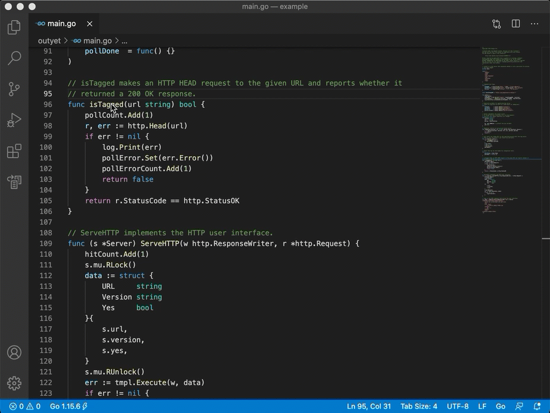 

### Fill struct literals

Use the [`Go: Fill struct`](commands.md#fill-struct) command to automatically fill a struct literal with its default values.

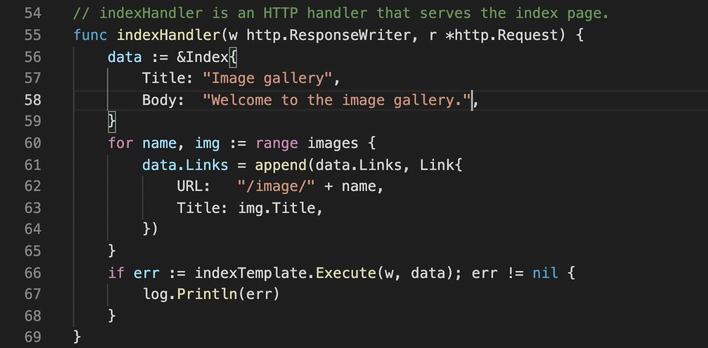 

## Diagnostics

Learn more about [diagnostic errors](tools.md#diagnostics).

### Build errors

Build errors can be shown as you type or on save. Configure this behavior through the [`"go.buildOnSave"`](settings.md#go.buildOnSave) setting.

By default, code is compiled using the `go` command (`go build`), but build errors as you type are provided by the [`gotype-live`](tools.md#diagnostics) tool.

### Vet errors

Vet errors can be shown on save. The vet-on-save behavior can also be configured through the [`"go.vetOnSave"`](settings.md#go.vetOnSave) setting.

The vet tool used is the one provided by the `go` command: [`go vet`](https://golang.org/cmd/vet/).

### Lint errors

Much like vet errors, lint errors can also be shown on save. This behavior is configurable through the [`"go.lintOnSave"`](settings.md#go.lintOnSave) setting.

The default lint tool is [`staticcheck`]. However, custom lint tools can be easily used instead by configuring the [`"go.lintTool"`](settings.md#go.lintTool) setting. [`golint`], [`golangci-lint`], and [`revive`] are also supported.

For a complete overview of linter options, see the [documentation for diagnostic tools](tools.md#diagnostics).

## Run and test in the editor

### Run your code

To run your code without debugging, use the keyboard shortcut `Ctrl+F5` or run the command `Debug: Start without Debugging`. To debug, see [Debugging](#debugging) below.

This command requires you to have a [launch configuration](debugging.md#launch-configuration) in a `launch.json` file. To open or create your `launch.json`, run the `Debug: Open launch.json` command. Use the default `Go: Launch file` configuration.

Behind the scenes, the `Debug: Start without Debugging` command calls `go run`. `go run` usually requires the path to the file to run, so your `launch.json` should contain `"program": "${file}"`.

### Test and benchmark

[Test UI](https://code.visualstudio.com/api/extension-guides/testing) and [Code lenses](https://code.visualstudio.com/blogs/2017/02/12/code-lens-roundup) allow users to easily run tests, benchmarks, and profiles for a given function, file, package, or workspace.

Alternatively, the same functionality is available through a set of commands: [`Go: Test Function At Cursor`](commands.md#go-test-function-at-cursor), [`Go: Test File`](commands.md#go-test-file), [`Go: Test Package`](commands.md#go-test-package), and [`Go: Test All Packages in Workspace`](commands.md#go-test-all-packages-in-workspace).

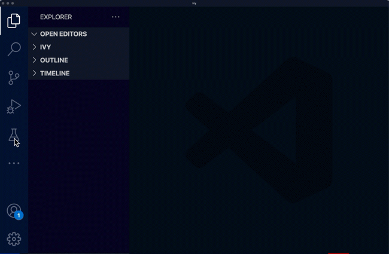 

### Code Coverage

Show code coverage in the editor, either after running a test or on-demand. This can be done via the commands: [`Go: Apply Cover Profile`](commands.md#go-apply-cover-profile) and [`Go: Toggle Test Coverage in Current Package`](commands.md#go-toggle-test-coverage-in-current-package).

### Profiling

"Go Test: Profile" menu in [Test UI](https://code.visualstudio.com/api/extension-guides/testing) collects CPU/Memory/Mutex profiles and allows visualizing them using pprof (`go tool pprof`).

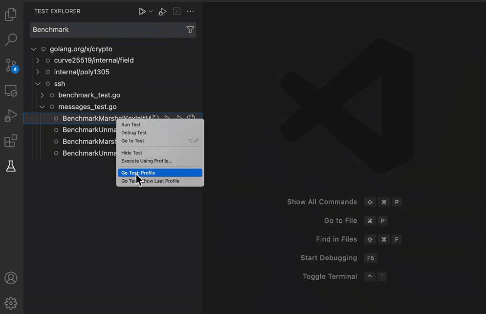 

## [Debugging](debugging.md)

This extension offers debugging of Go programs. See the [debugging documentation](debugging.md) for more information.

## Other

### Go Playground

Export your current file to the [Go Playground](https://play.golang.org) via the [`Go: Run On Go Playground`](settings.md#go-run-on-go-playground) command. This is useful for quickly creating a piece of sample code.

[`gopls`]: gopls.md
[`staticcheck`]: https://staticcheck.io/
[`golint`]: https://pkg.go.dev/golang.org/x/lint/golint?tab=overview
[`golangci-lint`]: https://golangci-lint.run/
[`revive`]: https://github.com/mgechev/revive
