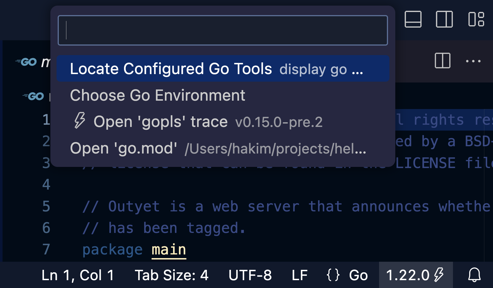
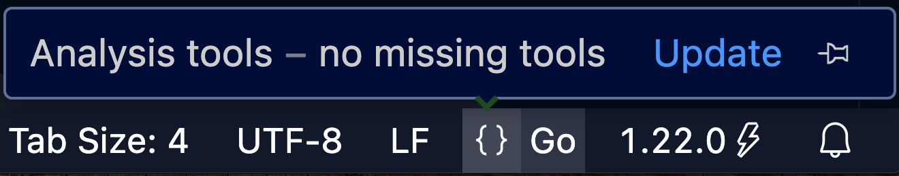
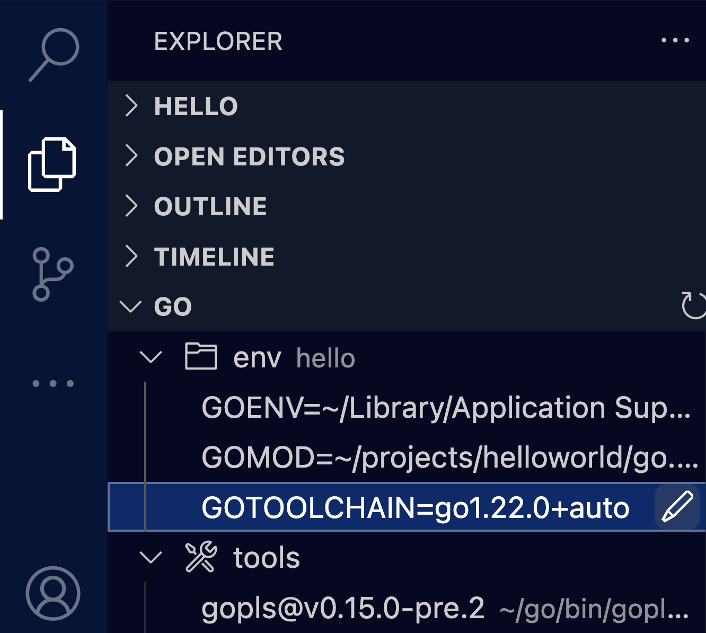

# Extension UI

## Using The Go Status Bar

The Go status bar appears in the lower right of the extension window, next to the Editor Language status bar item. Clicking the Go status bar brings up a menu that provides easy access to see and update important information about your Go project. This includes information about the Go environment, the current Go version, the `gopls` trace, and about the current module.

<div style="text-align: center;"> </div>

## Using The Language Status Bar

The Language status bar shows status of dependency tools installation or availability of newly released Go versions.

<div style="text-align: center;"> </div>
### Go Environment

The `Go Locate Configured Go Tools` command will display the configured GOPATH, GOROOT, tool locations and the results of `go env` in the output window.

### Managing Your Go Version

You can view the current Go version by looking at the status bar item in the bottom left corner of VS Code. Clicking this button and selecting `Choose Go Environment` will present you with a menu from which you can select any version of Go that exists in your $HOME/sdk directory or on <https://golang.org/dl>. This command is also available through the command pallette using `Go: Choose Go Environment`.

If you are using go1.21 or newer, you can control your Go version using the `GOTOOLCHAIN` environment variable. See https://go.dev/doc/toolchain for more information. To tell the extension to use a different `GOTOOLCHAIN`, use the `go.toolsEnvVars` setting or the Go explorer view.

```
"go.toolsEnvVars": {
	"GOTOOLCHAIN": "go1.21.0+auto"
}
```

You will need to reload the window after updating this setting. We are working on improving the version switch workflow.

Previously, the `go.goroot` and `go.alternateTools` settings controlled the Go version used by VS Code Go. If you have configured these settings, they are no longer needed and should be deleted.

### Installing a New Go Version

After selecting any Go version that has not yet been installed (such as Go 1.14.6 in the screenshot above), the binary will be automatically installed in $HOME/sdk and put to use in your environment.

Once the download completes, VS Code Go will make use of this new Go version.

### Language Server Status

`gopls` is the official Go [language server](https://langserver.org/) developed by the Go team. It was developed in response to the release of Go modules, and it is the recommended approach when working with Go modules in VS Code.

When `gopls` is enabled, :zap: is displayed next to the Go version in the Go status bar and the `gopls` version is displayed in the menu.

Selecting `Open 'gopls' trace` will open the trace of the `gopls` server in the output window. Please include this trace when filing an issue related to the extension and `gopls` is enabled.

### Modules Status

When modules are enabled for the file you have open, you can navigate to the `go.mod` file for the project using the menu. If you do not see the `Open go.mod` item, then the extension does not think the file you have open belongs to a module.

More information about [using Go modules](https://go.dev/blog/using-go-modules ) is available on the Go blog.

## Go Explorer View

The view displays the go environment variables (`go env`) that are applied to the file open in the editor. You can customize the list by "Go: Edit Workspace" command (pencil icon), and update modifiable environment variables through this view.

It displays required [tools](tools.md) and their location/version info, too.

<div style="text-align: center;"> </div>